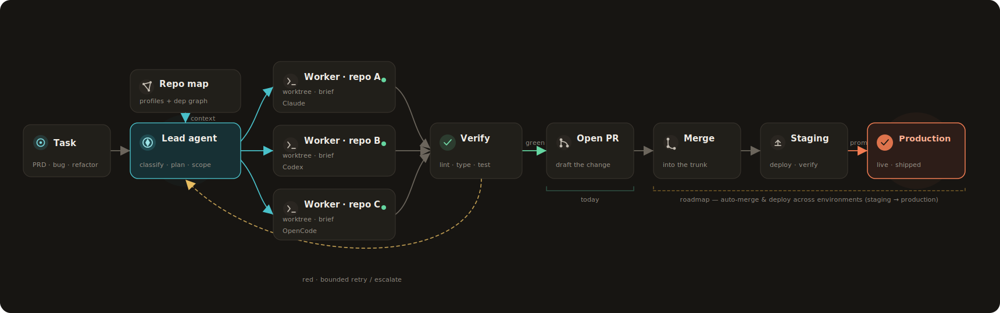
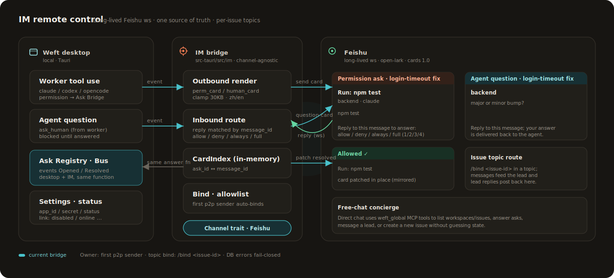
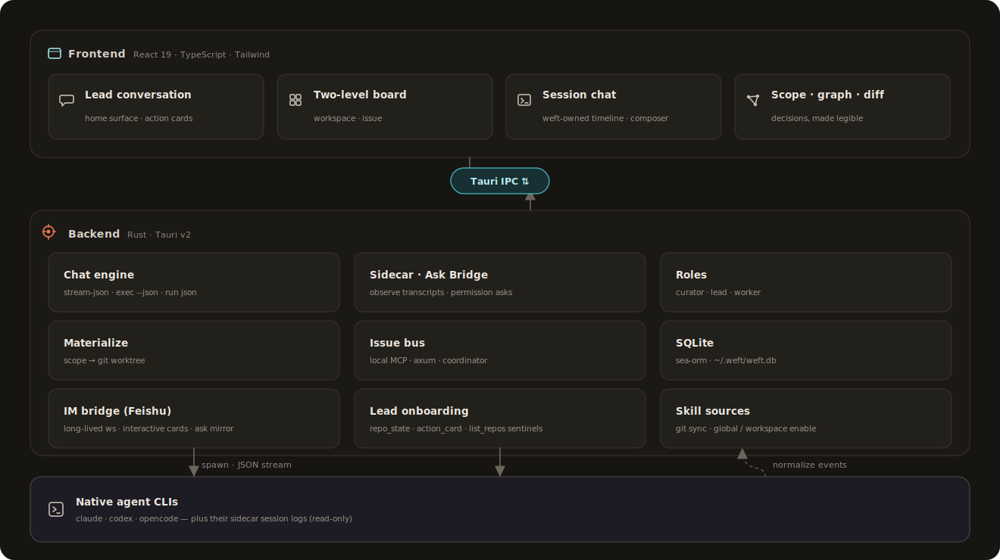
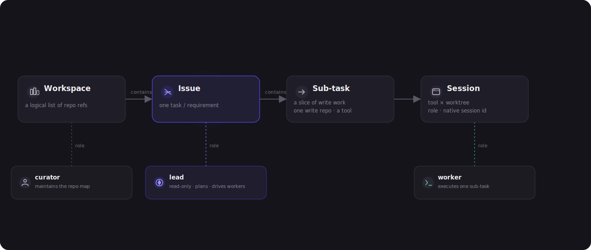

<div align="center">
  

### Local multi-repo delivery orchestration for your coding agents

Weft is a local multi-repo delivery orchestrator. Give it a requirement, and it
coordinates your own Claude Code, Codex, and OpenCode across repositories to
carry the work from intent toward implementation, merge, and release.

<sub>Tauri v2 · React 19 · Rust · SQLite · native coding-agent CLIs</sub>

[中文说明](README.zh-CN.md)
</div>

<p align="center">
  
</p>

## The 30-second version

Weft is not a terminal grid and not a hosted agent runner. It is the local
orchestration layer between a product requirement and the native coding agents,
repositories, branches, checks, and release paths you already use.

```text
Requirement → repo map → scoped agent work → repo-native branches → implementation → PR / merge / release
```

**Today:** local multi-repo planning, repo-native worktrees, native-agent
sessions, reviewable diffs, pre-PR checks, IM asks, keep-awake, and encrypted
database backup.

**North star:** one requirement in; Weft drives your own Claude Code, Codex, and
OpenCode through PR, merge, and release.

## When you don't need Weft

If you mostly work in **one repository** and already have a coding-agent workflow
you're happy with — a single Claude Code or Codex session, your own branches, your
own review habit — you probably don't need Weft. It earns its place the moment one
session stops being enough: work that spans **several repositories**, multiple
agents that have to stay coordinated under one issue, or long runs you want to keep
steering from your phone after you've left the desk.

## Why Weft is different

### 1. Orchestrate delivery across repos

You describe a feature, bugfix, refactor, or spike. The lead agent reads the
workspace repo map and proposes repo-scoped work: which repository needs
changes, why, and which worker should own that slice. Reads stay free; only
writes are approved, materialized, tracked, and reviewed.

### 2. Respect your origins

Weft works with the tools and repositories you already trust.

- **User origin:** Weft drives your native Claude Code, Codex, and OpenCode. It
  keeps their auth, hooks, approvals, sandbox rules, skills, and session identity.
- **Repo origin:** worktrees live under the target repo:
  `<repo>/.worktrees/weft/<branch-name>`. Branch names follow that repo's style:
  `feat/*` vs `feature/*`, `fix/*` vs `bugfix/*`.
- **Team origin:** teams can import git-hosted skill sources, enable each skill
  globally or per workspace, and still let personal or repo-owned skills win.
  Effective skills and rules are visible before a session runs.

### 3. Stay local, reachable, and recoverable

Weft treats long-running desktop automation as a product problem, not an
afterthought. It can prevent idle sleep while sessions run, keep the machine
awake for remote IM commands when the bridge is enabled, mirror asks to
Feishu/Lark, and back up the local SQLite state as encrypted snapshots to a
private Git remote with a separate Recovery Key.

## Similar products

Most tools in this space answer one question: how to run more agent sessions at
once. Weft answers a different one: **how to hand a real requirement to your
agents and trust it gets done.**

You give a requirement; Weft works out which repos to touch and why, and waits
for your go-ahead before it writes. Several agents stay aligned like one small
team while you follow a single issue. When an agent gets stuck it comes to you —
and you can keep steering from Feishu/Lark after you close the laptop. Every
change lands in its own isolated copy, so your main branch stays clean and the
diff is one glance to review, with encrypted backups you can restore on a new
machine.

| Product | What it's good at | How Weft is different |
|---|---|---|
| [Multica](https://github.com/multica-ai/multica) / [self-hosting](https://multica.ai/docs/self-host-quickstart) | A team platform that treats agents as first-class teammates: assign issues, track blockers and statuses, reuse skills, and route work to the right member through Squads; runs as a local daemon, cloud, or self-hosted. | You're not running an agent workforce. Hand Weft a requirement and it decides which repos to touch and who does what, then hands you a reviewable diff — more like giving the job to a dependable delivery lead than staffing a board. |
| [Vibe Kanban](https://github.com/BloopAI/vibe-kanban) / [docs](https://vibekanban.com/docs) | A planning-and-review board for coding agents: issues become prompts, each workspace is a git worktree and branch, with diffs, inline comments, previews, and PR creation in one surface. [Official maintenance stopped in 2026-04](https://www.vibekanban.com/blog/shutdown) (hosted services sunset); now community-maintained, local app still works. | A board starts from cards you've already broken down; Weft steps in before that — it reads across your repos, works out what to change itself, and drives several agents forward while you follow one issue. |
| [Conductor](https://www.conductor.build/docs) / [Parallel Code](https://github.com/johannesjo/parallel-code) | Local parallel worktree runners. Conductor is a Mac-only closed-source app giving each task a Git-backed isolated workspace (its own branch, working tree, terminal, diff, review) for Claude Code/Codex/Cursor; Parallel Code is open-source (MIT) Electron for Mac+Linux, each task "in its own git worktree," for Claude/Codex/Gemini/Copilot/Antigravity. | They run several agents side by side on one repo; Weft runs one delivery across many — from which repos to touch, to taking over from Feishu after you close the laptop, to restoring on a new machine, all carried by the one job. |
| [Claude Squad](https://github.com/smtg-ai/claude-squad) | A multi-agent manager that lives in your terminal (TUI): tmux + git worktrees for isolation, a branch per session, for Claude Code/Codex/Gemini/Aider/OpenCode; open-source (AGPL-3.0). | Claude Squad lives in the terminal; Weft gives you a desktop delivery station you can walk away from — a stuck agent comes to you, you clear it from Feishu/Lark, and long runs stay awake and recoverable. |
| [Nimbalyst](https://nimbalyst.com) (successor to [Crystal](https://github.com/stravu/crystal)) | Parallel experimentation. Crystal pioneered running multiple Claude Code sessions in isolated git worktrees; it's no longer maintained, and Nimbalyst succeeds it with Codex support, a session kanban, visual editors, and an iOS app. | It lets you try several approaches at once; Weft is about walking one delivery all the way through — scope confirmation, answering the agent's questions, diff, checks, and recovery all pinned to the same work item. |
| [Sculptor](https://github.com/imbue-ai/sculptor) | A native desktop app (Apple Silicon Mac + Linux; Windows via WSL) that isolates each task in a Docker container instead of a worktree, with a Pairing Mode that syncs container changes back to your local IDE; parallel Claude Code; experimental preview. | Sculptor leans on Docker containers and is still experimental; Weft isolates in repo-native copies with no Docker to install, branches follow each repo's own style, and diffs stay reviewable with pre-PR checks. |
| [Omnara](https://www.omnara.com/) / [repo](https://github.com/omnara-ai/omnara) | A command center for your coding agents: runs Claude Code and Codex in parallel and controls them from desktop/web/phone/watch + voice, with per-repo cloud sync. The older open-source CLI wrapper was archived in 2026-02 in favor of a platform built on the Claude Agent SDK. | Omnara moves the session to the cloud to keep it alive remotely; Weft does the opposite — your code and state stay on your machine, and only the agent's questions and permission asks follow you to Feishu, so you can decide without standing guard. |

> Cloud agents (Devin, OpenAI Codex cloud, Cursor background agents) run your
> code on a remote sandbox — a different category: they take the work to the
> cloud, Weft keeps it on your machine.

## What it feels like

<p align="center">
  
</p>

1. Add existing repositories to a workspace.
2. Start an issue and describe the goal to the lead agent.
3. Review the proposed work items: repository, reason, tool, and mandate.
4. Approve the work items that should become worktrees.
5. Workers run headless native CLI sessions and stream back into Weft.
6. You answer real blockers, inspect diffs, and run checks before PR.

The human handles exceptions, not the assembly line.

## Operate from chat when you are away

<p align="center">
  
</p>

Workers can mirror permission asks and agent questions to Feishu/Lark as
interactive cards. Replying on mobile resolves the same underlying ask the
desktop UI would resolve, and both surfaces patch to the same final state.
You can also use a Feishu/Lark reply thread as the remote room for a Weft issue:
send `/topic <issue-id>` in a group to create or reuse the thread, or send
`/bind <issue-id>` inside an existing reply thread. Messages in that thread
route back into the issue's lead conversation.

The bridge currently covers:

- Permission asks and agent questions.
- Issue-to-Feishu reply thread routes for lead messages.
- Concierge-style direct chat backed by the `weft_global` MCP tools.
- Online resync summaries for pending Needs-you items.

Binding is conservative: the first private-chat sender can become owner, group
messages cannot bind ownership, and DB errors fail closed.

## Product surfaces

| Workspace board | Issue board |
|---|---|
|  |  |

| Repository map | Lead conversation |
|---|---|
|  |  |

## Architecture

<p align="center">
  
</p>

The Rust backend owns the local SQLite store, git worktree lifecycle, headless
agent processes, Ask Bridge, local MCP Bus, IM bridge, skill sources, power
guards, encrypted backup, and sidecar observation. The React frontend renders
the workspace board, issue board, lead conversation, worker sessions,
observe/diff views, settings, and Needs-you queue.

<p align="center">
  
</p>

## Current capabilities

- **Multi-repo planning:** add, clone, or create workspace repos; the lead reads the repo map and proposes repo-scoped work with reasons.
- **Native execution:** each approved work item gets a repo-native worktree and branch; Claude Code, Codex, and OpenCode workers run as native CLI sessions.
- **Controlled collaboration:** planner MCP, Ask Bridge, local MCP Bus, queueing, interrupt, resume, slash commands, and attachments all stay under one issue.
- **Remote reachability:** Feishu/Lark cards handle permission asks and agent questions; reply threads can manage issue conversations and route messages back to the lead.
- **Review surface:** materialized worktrees expose diffs and pre-PR checks, with sidecar observation for Claude jsonl, Codex rollout jsonl, and OpenCode SQLite.
- **Team configuration:** git-backed skill sources, personal skill preservation, global/workspace enablement, and per-repo effective skills/rules preview.
- **Long-run safety:** keep-awake, remote standby, and encrypted `weft.db` backups to a private Git remote with schedule, on-exit backup, restore, and Recovery Key export.
- **Workspace hygiene:** rename and cascade-delete for workspaces, issues, and sub-tasks, plus English and Chinese UI.

Not yet productized: automatic PR creation, protected-branch merge orchestration,
CI/CD observation, deployment orchestration, workspace rule packs, team
marketplace sync, and the long-running semantic Curator.

## Development

```bash
npm install
npm run dev          # Vite frontend
npm run build        # TypeScript check + production frontend bundle
npm run tauri dev    # full desktop app
npm run tauri build  # release app bundle
cd src-tauri && cargo test
git diff --check
```

## Project Layout

```text
src/
  board/                workspace and issue boards
  session/              chat, observe, diff, permissions
    blocks/             chat-timeline rich blocks
    useRepoActions.ts   add / clone / create repo from lead action cards
  components/           shared React UI
  i18n/                 English and Chinese strings
src-tauri/src/
  lead_chat/            headless agent session engine
    sentinels.rs        parse <weft:action_card> / <weft:list_repos/> markers
    repo_state.rs       <repo_state> snapshot injected into the lead prompt
  im/                   IM bridge (Channel trait + Feishu adapter, ws + cards)
  store/                SQLite/SeaORM entities and migrations
  bus/                  local MCP/thread bus + human-ask notifier
  ask.rs                permission Ask registry (desktop + IM mirrored)
  git.rs                repository and worktree operations
  materialize.rs
assets/
  screenshots/          README screenshots
  diagrams/             architecture and model diagrams
  readme/               generated README overview art
```

## Design Constraints

Weft drives native CLIs through structured, headless interfaces and renders its
own UI. Do not add embedded terminal/TUI dependencies for normal chat surfaces.
Terminal takeover remains an escape hatch for users who want the original CLI.
