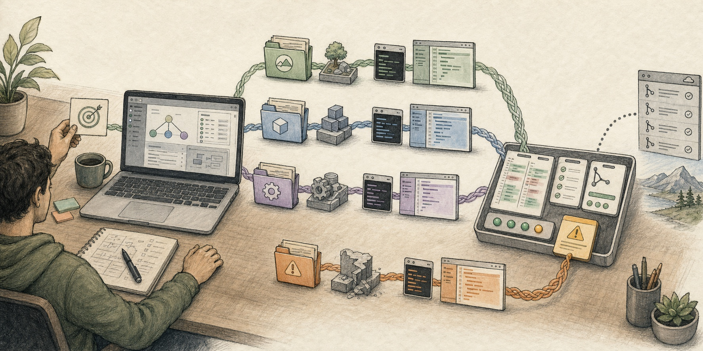
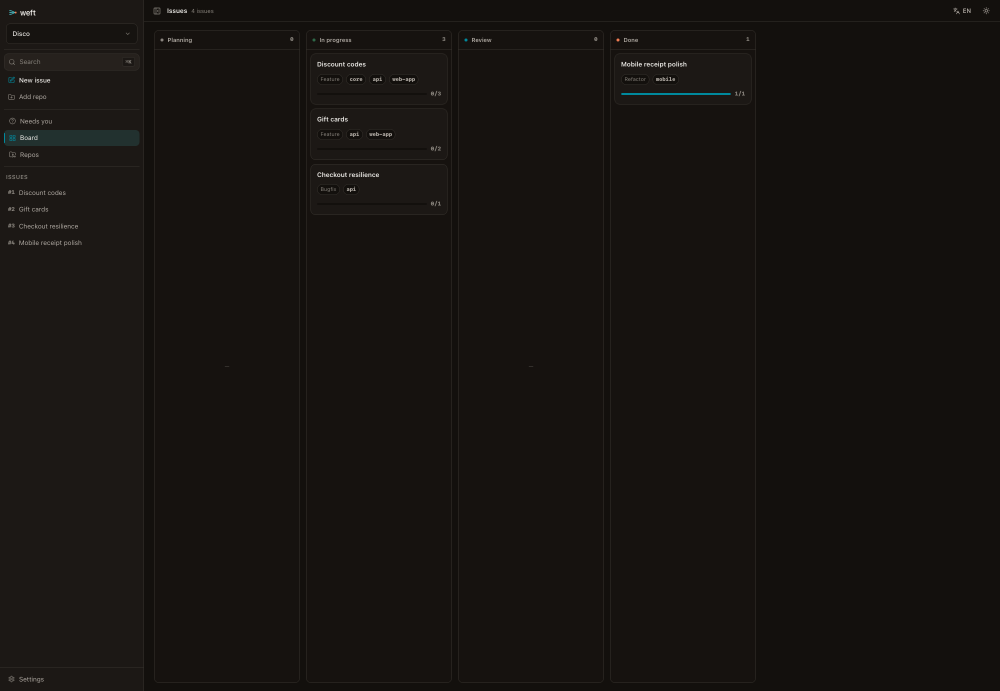
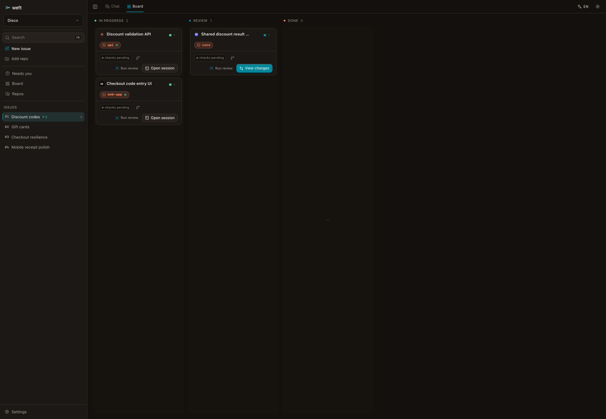
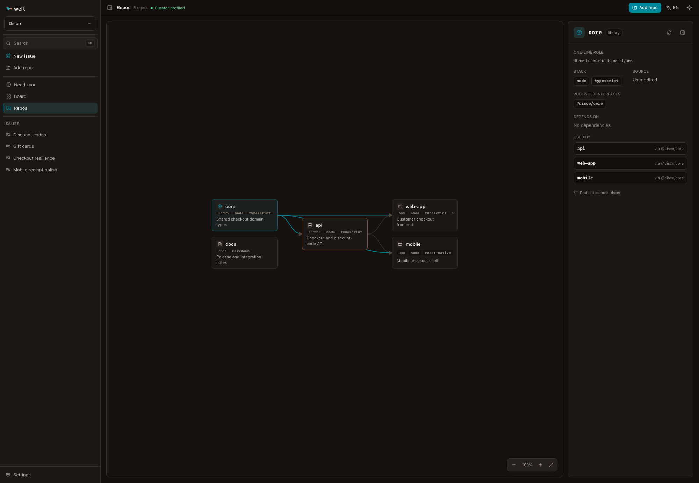
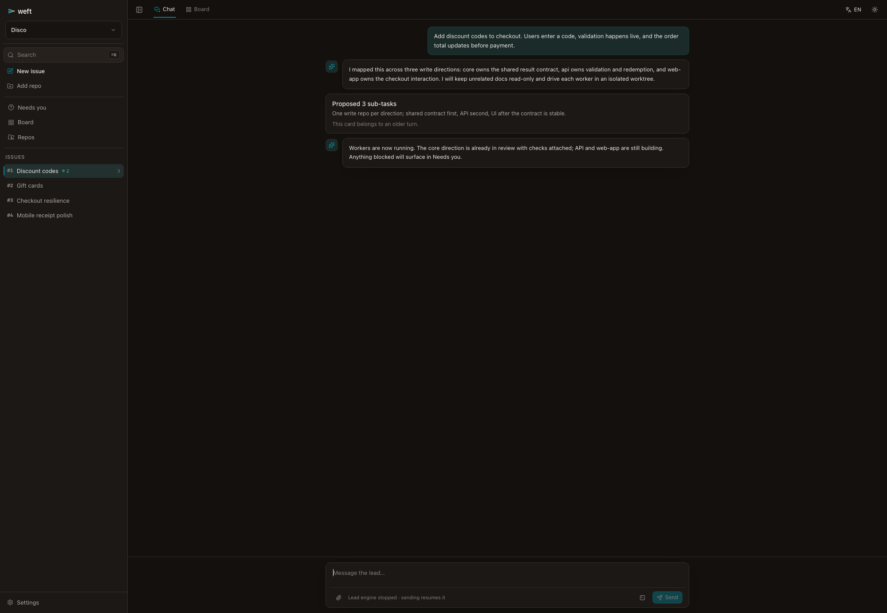
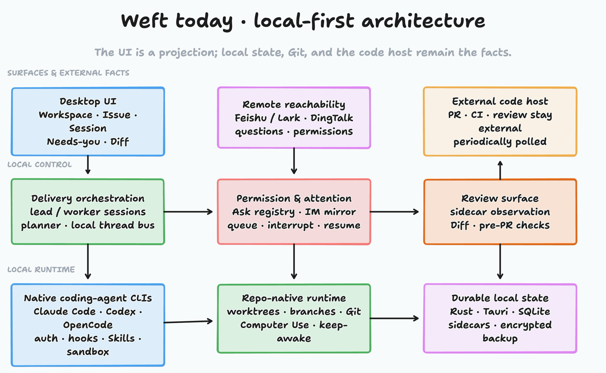

<div align="center">
  

### A local-first delivery system for coding agents

Weft turns one product goal into an auditable delivery across the repositories
that make up your product. It orchestrates your own Claude Code, Codex, and
OpenCode on your machine, keeps every write inside explicit authority boundaries,
and brings back evidence, decisions, and review-ready changes—not just chat logs.

<sub>Tauri v2 · React 19 · Rust · SQLite · native coding-agent CLIs</sub>

[中文说明](README.zh-CN.md)
</div>

<p align="center">
  
</p>

<p align="center"><sub>One local workbench: repository-scoped Runs stay inside policy and converge into evidence you can review.</sub></p>

## The 30-second version

Most coding-agent tools optimize a session. Weft is building the layer that owns
delivery across sessions, repositories, interruptions, and repeated work.

```text
Product goal → project context → dynamic change set → repository lanes
             → native agent runs → evidence → review / merge / release
```

In the finished product, you describe the outcome once. Weft works out which
repositories need to change, why they need to change, and in what order. Work
inside the project's authority policy can continue without per-repository approval;
anything outside that policy, high-risk, or uncertain stops at a focused gate. The
result is a set of isolated, verifiable changes whose readiness can be judged from
one place.

**Available today:** local multi-repo planning, repo-native worktrees, native agent
sessions, reviewable diffs, pre-PR checks, remote questions and approvals,
keep-awake, and encrypted `weft.db` snapshots.

**Product direction:** a delivery system you can walk away from, return to, and
trust—and, over time, a project roster of long-lived coding agents that retain
explicit responsibilities and verified project knowledge across issues.

## The north-star experience

1. **Describe one outcome.** Start an Issue inside a long-lived Project context
   (called a Workspace in the current UI).
2. **Let Weft map the delivery.** The lead reads the repository map, current code,
   authority policy, and verified delivery history. It maintains a dynamic change
   set rather than asking you to pre-split the work.
3. **Make every write explicit.** Each repository that will be changed gets a
   public Lane with a reason, target, dependencies, completion criteria, and the
   policy decision that allowed it.
4. **Run the tools you already trust.** Claude Code, Codex, and OpenCode execute in
   repo-native worktrees with their own authentication, skills, hooks, sandboxing,
   and resumable session identity.
5. **Verify facts, not claims.** Diffs, commits, checks, interface agreements, PRs,
   CI, reviews, conflicts, decisions, and risks become revision-aware Evidence.
   A successful model response is never enough to mark the delivery ready.
6. **Walk away safely.** Weft keeps moving only while the current policy and local
   conditions allow it. Interruptions become recoverable states. When a coding
   agent reaches a usage limit, Weft records the recovery point and resumes safely
   when capacity returns instead of blindly retrying or losing the run.
7. **Return to the result.** The Issue opens with what changed, what is blocked,
   what needs you, and what remains before every active Lane is review-ready.
8. **Build continuity across work.** Project knowledge keeps its source and
   revision. Long-lived Agent profiles, Positions, and Assignments make ownership
   visible across Issues without granting implicit authority.

The human owns product judgment, authority, and high-risk decisions. Weft owns
the polling, bookkeeping, recovery, and routine coordination.

<p align="center">
  
</p>

<p align="center"><sub>Continuity is a product state: wait safely, resume once, return with evidence, and carry verified responsibility across Issues.</sub></p>

## The product model

| Product object | What it means |
|---|---|
| **Project** | The long-lived code and delivery context: repositories, repo/service map, policy, skills, verified knowledge, Issues, and eventually the agent roster. The current UI calls this a Workspace. |
| **Issue** | One user-verifiable delivery outcome. It owns the dynamic change set, decisions, aggregate readiness, and remaining risk. |
| **Lane** | One public unit of repository write scope. A Lane writes exactly one repository and records its reason, target, dependencies, mandate, and authority decision. |
| **Run** | One execution attempt with a start, end, executor, native session, result, and recoverable failure state. Retrying does not erase history. |
| **Evidence** | Compact, source-linked proof from Git, checks, interfaces, the code host, decisions, and handoffs. |
| **Gate** | A specific human decision required because work is outside policy, high-risk, or uncertain. It blocks only the affected work when safe alternatives remain. |
| **Agent · Position · Assignment** | A long-lived identity, a stable project responsibility, and the historical relationship between them. None of these grants permission by itself. |

Single-repository and multi-repository work use the same model. The UI can stay
compact for a small change and expose the full dependency graph when the delivery
actually spans repositories.

## Why Weft

### Delivery, not session management

A session can exit successfully while the feature is still incomplete. Weft
tracks the user outcome across planning, implementation, checks, PRs, reviews,
merges, interruptions, and multiple attempts. Sessions are replaceable execution
details; the delivery remains stable.

### Bounded autonomy, not approval fatigue

In the target model, every actual repository write remains visible and traceable.
The authority policy decides what can proceed automatically; a role, an agent's
past success, or a CLI permission answer cannot silently expand that boundary. The
goal is to ask only when a real decision is needed.

### Evidence, not confident narration

In the target model, the local filesystem and Git are authoritative for code
facts, while the code host is authoritative for PR, CI, review, conflict, and
merge facts. Weft will reconcile those sources after execution and fail closed
when it cannot establish what happened.

### Native tools, native repositories

- **Your agents:** Weft drives the native Claude Code, Codex, and OpenCode CLIs.
- **Your repositories:** worktrees and branches follow each repository's own
  layout and naming conventions; Weft does not replace Git hosting.
- **Your practices:** personal, Project, and repository Skills, plus personal and
  repository Rules, remain inspectable. Versioned sources keep their revisions,
  and the effective set is resolved before a Run starts.

### Local-first, but reachable

Code, credentials, agent processes, Git worktrees, and orchestration state stay on
your machine by default. Feishu/Lark or DingTalk can carry focused questions and
permission requests when you are away. Encrypted `weft.db` snapshots make the
orchestration database recoverable; they do not include repository worktrees,
unpushed branches, or native-agent session stores.

### A project that learns without becoming opaque

Verified repository relationships, interface agreements, Skills, failure lessons,
and delivery patterns can improve later work. Every reusable item keeps provenance,
revision, validity, and a way to correct, supersede, or revoke it. Chat history does
not silently become permanent truth.

## Target authority and safety boundaries

This is the enforcement model Weft is building toward, not a claim about the
current release. Today, worktree materialization is confirmation-gated; the
complete Lane, AuthorityPolicy, Gate, and effect-reconciliation loop belongs to R1.

- Every write is attributable to a public Lane and the AuthorityPolicy revision
  that allowed it.
- Reading a repository and writing a repository are separate capabilities.
- Policy-compliant work can proceed automatically; protected branches,
  credentials, releases, production, irreversible actions, policy changes, and
  uncertain scope require a Gate or are denied.
- Weft checks the boundary before execution and reconciles the actual filesystem,
  Git, push, and PR effects afterward.
- Policy drift or unknown state stops subsequent writes and fails closed.
- Agent identity, Position, Role profile, feedback, and prior success never grant
  additional authority.
- Production changes remain outside automatic execution by default.

## Roadmap

The roadmap is ordered by user outcome and exit criteria, not by feature count or
calendar promises. Only the current milestone is a commitment; later stages enter
after their prerequisites are proven in real deliveries.

| Order | Milestone | User outcome |
|---|---|---|
| **NOW** | **R1 · Cross-repository delivery loop** | Describe a real requirement once; Weft maintains policy-checked repository Lanes and their dependencies until every active Lane is review-ready. |
| **NEXT** | **R2 · Walk-away execution and trustworthy recovery** | Leave the screen while work continues safely. Restarts, sleep, network loss, stalled runs, expired credentials, and agent usage limits become visible, resumable states with quiet, focused Needs-you prompts. |
| **THEN** | **R3 · Keep internal work inside the delivery** | Research, retries, reviews, experiments, and subagents fold into their Lane. The main view shows outcomes, Evidence, risks, and decisions while the full Run history remains inspectable. |
| **LATER** | **R4 · Compounding project knowledge and long-lived agents** | Build an agent roster with stable Positions and Assignment history. Agents reuse verified project knowledge, Skills, and delivery patterns across Issues while memory and authority remain explicit. |
| **EXPLORE** | **R5 · Signals and operations** | Bring alerts and external events into bounded, read-only investigation; promote them into a normal Issue before any repository write. |

The order matters: reliable delivery produces trustworthy Evidence; trustworthy
Evidence makes recovery and process compression safe; only then can project memory
and long-lived agents reuse experience without turning guesses into policy.

## What works today

- **Multi-repo planning:** add, clone, or create Workspace repositories; the lead
  reads the repo map and proposes repository-scoped work with reasons.
- **Native execution:** approved work gets a repo-native worktree and branch;
  Claude Code, Codex, and OpenCode run as native CLI sessions.
- **Controlled collaboration:** lead and worker sessions, planner tools, local
  thread bus, permission asks, queueing, interrupt, resume, slash commands, and
  attachments stay tied to the same Issue.
- **Review surface:** materialized worktrees expose diffs and pre-PR checks, with
  sidecar observation for Claude JSONL, Codex rollout JSONL, and OpenCode SQLite.
- **PR monitoring and guarded merge:** tracked GitHub PRs are polled for CI,
  review, unresolved threads, conflicts, and cross-repository upstream readiness.
  Optional auto-merge squash-merges only after fresh host facts clear its gate.
- **Remote reachability:** Feishu/Lark or DingTalk can carry agent questions and
  permission decisions back to the same local state.
- **Team configuration:** Git-backed Skill sources, personal Skill preservation,
  global/Workspace enablement, and per-repository effective Skills/Rules preview.
- **Long-run safety:** keep-awake, remote standby, and encrypted `weft.db`
  snapshots to a private Git remote with recovery-key export and restore.
- **Workspace hygiene:** rename and cascade-delete for Workspaces, Issues, and
  work items, plus English and Chinese UI.

Not yet productized are the complete Issue/Lane/Run/Evidence model, automatic PR
creation, CI/CD and deployment observation beyond tracked-PR readiness,
quota-aware automatic resumption, process compression, Project knowledge, and the
long-lived agent roster. They are roadmap outcomes, not current-product claims.

## Who it is for

Weft is for developers and technical leads who already use local coding-agent
CLIs and regularly coordinate changes across services, SDKs, frontends,
infrastructure, or release repositories. It becomes useful when one session is no
longer enough, when work must survive interruptions, or when you need to know the
whole delivery is ready without reopening every transcript.

If you work mainly in one repository and your current single-agent, branch, and
review workflow already feels complete, Weft may add more structure than value.
It is not intended to replace Git hosting, general project management, the coding
agents themselves, or production-operations controls.

## Product surfaces today

| Workspace board | Issue board |
|---|---|
|  |  |

| Repository map | Lead conversation |
|---|---|
|  |  |

## Architecture today

<p align="center">
  
</p>

<p align="center"><sub>Current architecture: local control and execution, with external code-host facts refreshed by periodic background polling.</sub></p>

The Rust backend owns the local SQLite store, Git worktree lifecycle, headless
agent processes, permission registry, local thread bus, IM bridge, Skill sources,
power guards, encrypted backup, computer-use control, and sidecar observation. The
React frontend renders the Workspace and Issue boards, lead and worker sessions,
observe/diff views, settings, and Needs-you queue.

## Development

```bash
pnpm install
pnpm dev             # Vite frontend
pnpm build           # TypeScript check + production frontend bundle
pnpm tauri dev       # full desktop app
pnpm tauri build     # release app bundle
cd src-tauri && cargo test
git diff --check
```

## Project layout

```text
src/
  board/                Workspace and Issue boards
  session/              chat, observe, diff, permissions
  components/           shared React UI
  i18n/                 English and Chinese strings
src-tauri/src/
  lead_chat/            headless agent session engine
  im/                   Feishu/Lark and DingTalk bridge
  store/                SQLite/SeaORM entities and migrations
  bus/                  local MCP/thread bus
  computer/             controlled desktop computer use
  ask.rs                permission registry shared by desktop and IM
  git.rs                repository and worktree operations
  materialize.rs        scoped worktree materialization
assets/
  screenshots/          README screenshots
  diagrams/             architecture diagrams
  readme/               README overview artwork
```

## Design constraints

Weft drives native CLIs through structured, headless interfaces and renders its
own product UI. Normal chat surfaces do not embed terminal/TUI dependencies;
terminal takeover remains an escape hatch. Cross-repository wiring lives in
Weft-managed state or worktree-local configuration, never as hidden changes to
canonical repositories.
