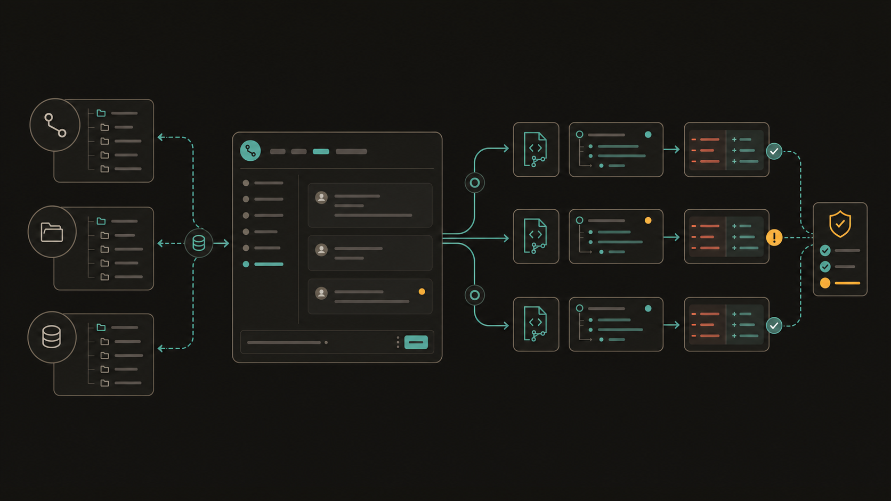
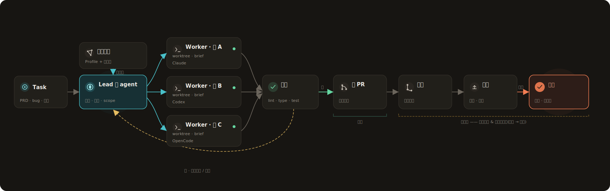
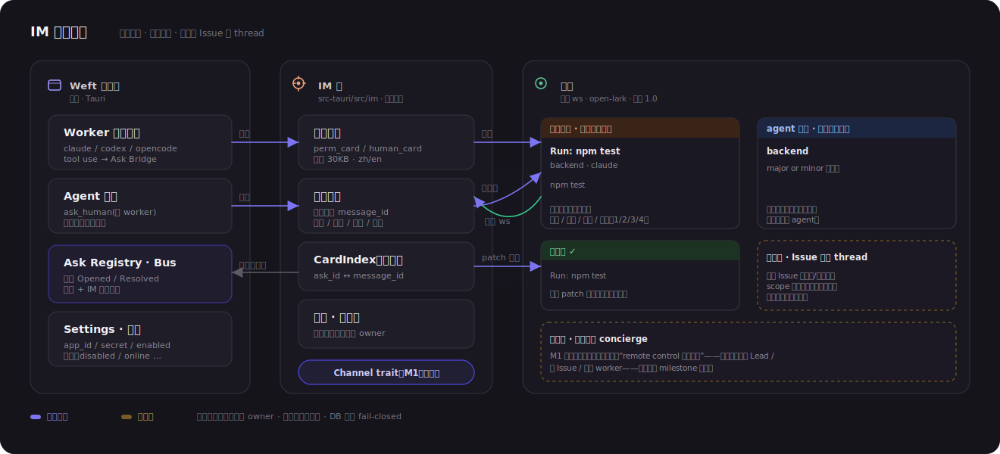
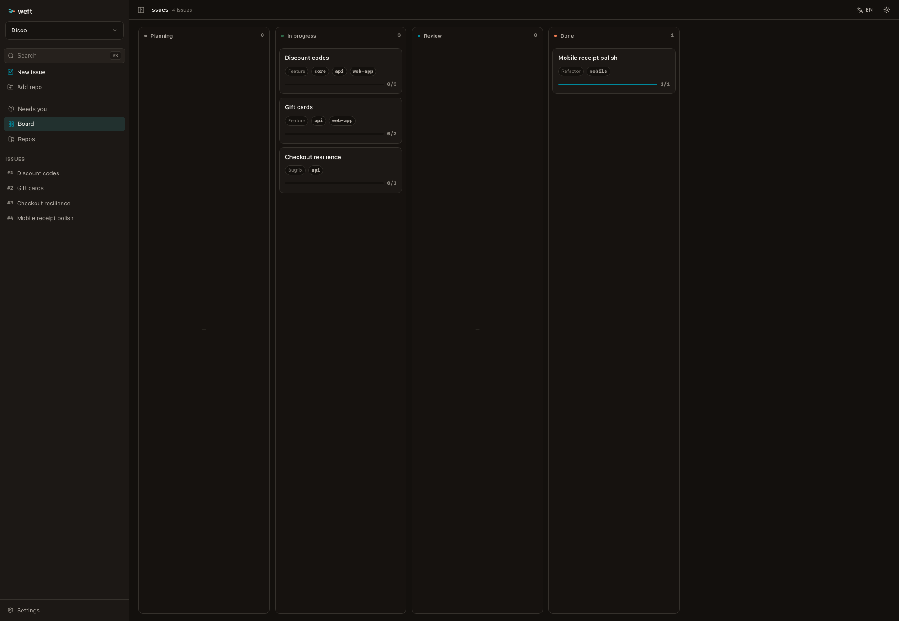
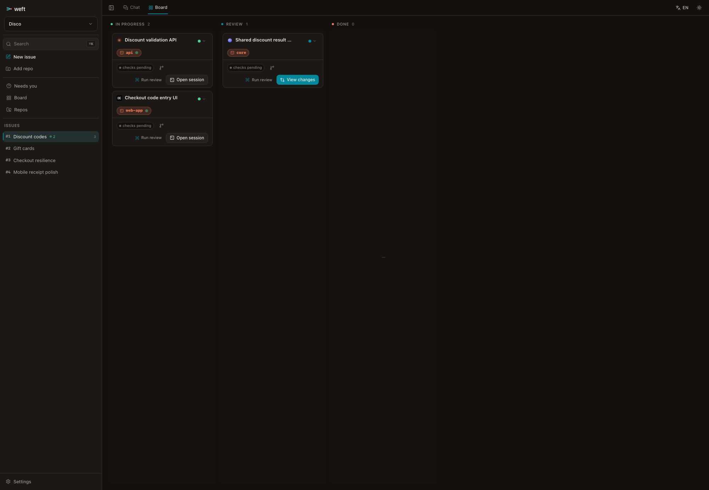
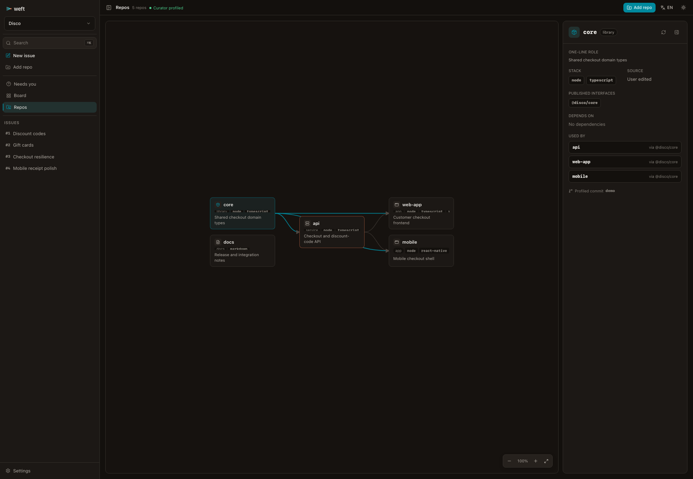
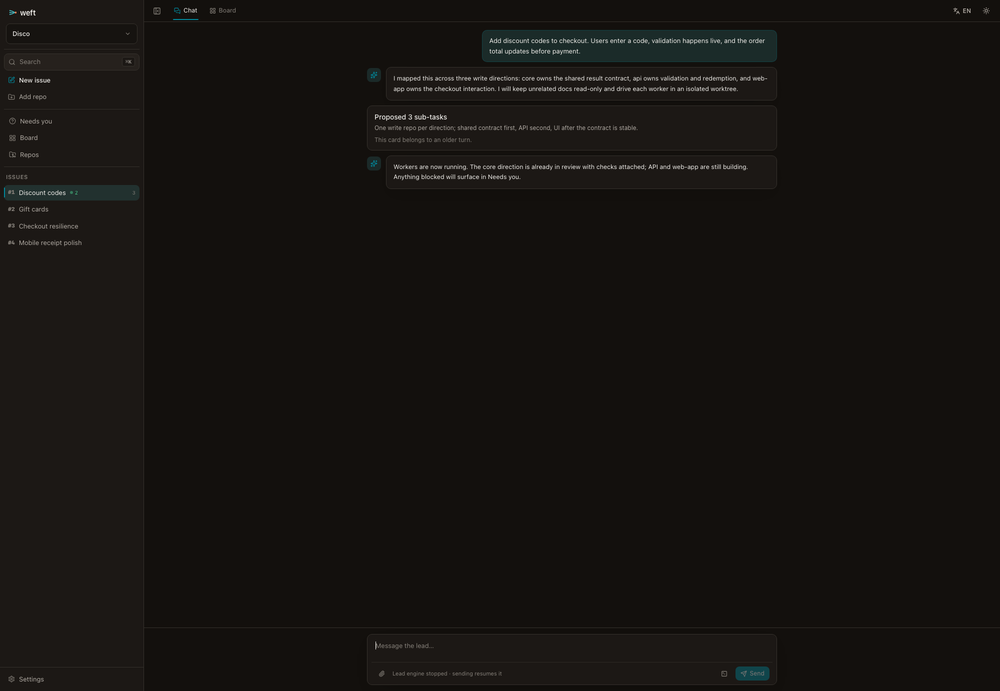
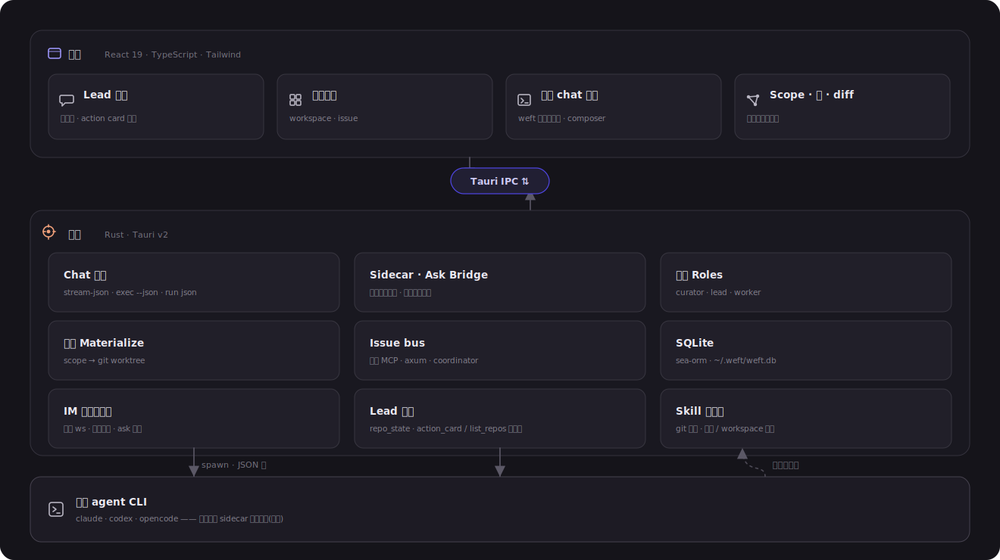
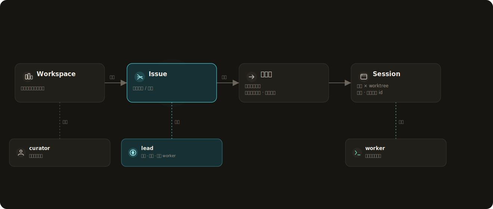

<div align="center">
  

### 本地多仓交付编排器，指挥你自己的 Coding Agents

Weft 是一个本地多仓交付编排器。你给它一个需求，它会指挥你自己的 Claude Code、
Codex、OpenCode 跨多个仓库推进，把需求从意图一路带向实现、合并和上线。

<sub>Tauri v2 · React 19 · Rust · SQLite · Native Coding-Agent CLIs</sub>

[English](README.md)
</div>

<p align="center">
  
</p>

## 30 秒看懂

Weft 不是终端网格，也不是云端 agent runner。它是在你的需求、原生 coding agents、
仓库、分支、检查和发布流程之间做协调的本地编排层。

```text
需求 → 仓库地图 → 有边界的 agent 工作拆分 → 仓库原生分支 → 实现 → PR / 合并 / 上线
```

**当前能力：** 本地多仓规划、仓库原生 worktree、原生 agent 会话、可 review 的 diff、
pre-PR checks、IM 问答、运行中防休眠、加密数据库备份。

**最终目标：** 你给一个需求，Weft 指挥你自己的 Claude Code、Codex、OpenCode 一路做到
PR、合并和上线。

## Weft 的不同之处

### 1. 编排跨仓库交付

你描述 feature、bugfix、refactor 或 spike。Lead agent 读取 workspace 的 repo map，
提出按仓库约束的工作拆分：哪个仓库需要改、为什么要改、由哪个 worker 负责。读取仓库是自由的；
只有写入会被确认、创建工作目录、追踪和 review。

### 2. 尊重你的原有习惯

Weft 和你已经信任的工具、仓库一起工作。

- **尊重用户工具：** Weft 驱动你自己的 Claude Code、Codex、OpenCode，保留它们的登录态、hooks、审批、sandbox、skills 和 session 身份。
- **尊重仓库习惯：** worktree 创建在目标仓库内：`<repo>/.worktrees/weft/<branch-name>`。分支名跟随该仓库已有风格，例如 `feat/*` vs `feature/*`、`fix/*` vs `bugfix/*`。
- **尊重团队经验：** 团队可以导入 Git 托管的 Skill 源，按全局或 workspace 选择性启用；个人或仓库自带的同名 Skill 仍可优先。会话开始前可以查看每个仓库最终生效的 Skills 和 Rules。

### 3. 本地运行，远程可达，数据可恢复

Agent 交付经常是长时间运行的桌面工作。Weft 可以在 session 运行时阻止系统空闲休眠；
开启 IM 桥时保持远程待命，让飞书指令随时到达；也可以把本地 SQLite 状态库加密备份到
私有 Git 远端，并单独导出 Recovery Key，方便换机或故障后恢复。

## 同类产品对比

大多数同类工具在解决同一个问题：怎么同时多开几个 agent 会话。Weft 解决的是另一个
问题：**怎么把一个真实需求，放心交给 agent 做完。**

你给一个需求，Weft 先替你想清楚要动哪些仓库、为什么动，等你确认才开工；多个 agent
像一个小组那样彼此对齐，你全程只盯一个 issue；它卡住会主动问你，人离开电脑也能在
飞书/Lark 上继续指挥；每一处改动都在隔离副本里完成，主分支始终干净、diff 一眼可
review，状态还能加密备份、换机即恢复。

| 产品 | 它擅长什么 | Weft 的不同 |
|---|---|---|
| [Multica](https://github.com/multica-ai/multica) / [self-hosting](https://multica.ai/docs/self-host-quickstart) | 把 agent 当一等队友的团队平台：给 agent 分配 issue、跟踪 blocker 和 status、复用 skill，并通过 Squads 把活路由给合适的成员；支持 local daemon、cloud 和 self-hosted 三种 runtime。 | 你不用去经营一支 agent 团队。把一个需求交给 Weft，它替你定好动哪些仓库、谁来做，做完直接给你能 review 的 diff——更像把活交给一个靠谱的交付负责人，而不是给你一块排期看板。 |
| [Vibe Kanban](https://github.com/BloopAI/vibe-kanban) / [文档](https://vibekanban.com/docs) | 面向 coding agent 的规划与 review 看板：issue 变成 prompt，每个 workspace 一个 git worktree 和分支，diff、行内评论、preview、PR 创建集中在一个界面。已于 [2026-04 停止官方维护](https://www.vibekanban.com/blog/shutdown)（远程服务停服），转社区维护、本地仍可用。 | 看板是从你已经拆好的卡片开始的；Weft 从需求还没拆时就接手——读懂你的多个仓库，自己拆出该动哪里，多个 agent 协同往前推，你只看一个 issue 的推进。 |
| [Conductor](https://www.conductor.build/docs) / [Parallel Code](https://github.com/johannesjo/parallel-code) | 本地并行 worktree runner。Conductor 是 Mac 专属闭源应用，每个 task 一个 Git 隔离工作区（独立 branch、working tree、终端、diff、review），驱动 Claude Code/Codex/Cursor；Parallel Code 是开源（MIT）Electron 应用，Mac+Linux，每个任务“各自一个 git worktree”，支持 Claude/Codex/Gemini/Copilot/Antigravity。 | 它们在一个仓库里并排跑几个 agent；Weft 管的是跨多个仓库的一整次交付：从该动哪些仓库，到合上电脑用飞书接管，到换机恢复，都跟着这一个任务走。 |
| [Claude Squad](https://github.com/smtg-ai/claude-squad) | 终端里的多 agent 管理器（TUI）：用 tmux + git worktree 隔离，每个会话独立分支，支持 Claude Code/Codex/Gemini/Aider/OpenCode；开源（AGPL-3.0）。 | Claude Squad 活在终端里；Weft 给你一个能放心走开的桌面交付台——agent 卡住主动找你，飞书/Lark 上随手放行，长任务防休眠、状态可恢复。 |
| [Nimbalyst](https://nimbalyst.com)（[Crystal](https://github.com/stravu/crystal) 后继） | 并行实验工作区。Crystal 最早把“多个 Claude Code 会话跑在隔离 git worktree 里”做成形，现已停止维护，由 Nimbalyst 接棒，新增 Codex 支持、session 看板、可视化编辑和 iOS app。 | 它让你同时试几条思路；Weft 更想让一条交付真正走完——范围确认、人工答疑、diff、检查到恢复，都钉在同一个工作单元上。 |
| [Sculptor](https://github.com/imbue-ai/sculptor) | 原生桌面应用（Apple Silicon Mac + Linux，Windows 走 WSL），用 Docker 容器（而非 worktree）隔离每个任务，Pairing Mode 把容器改动同步回本地 IDE；并行跑 Claude Code；实验性预览。 | Sculptor 依赖 Docker 容器、还在实验阶段；Weft 用仓库原生的隔离副本、不装 Docker 也能跑，分支跟随目标仓库风格，diff 可 review、可做 pre-PR 检查。 |
| [Omnara](https://www.omnara.com/) / [仓库](https://github.com/omnara-ai/omnara) | 你的 coding agent 指挥台：并行跑 Claude Code 与 Codex，从桌面/网页/手机/手表 + 语音随处控制，按仓库做云端续跑。旧的开源 CLI wrapper 已于 2026-02 归档，转向基于 Claude Agent SDK 的新平台。 | Omnara 把会话搬到云端、让它在远端续命；Weft 反过来——代码和状态全程留在你机器上，只把 agent 的提问和权限请求追到飞书，你不用守着也能拍板。 |

> 云端 agent（Devin、OpenAI Codex cloud、Cursor background agents）在远端沙箱里跑
> 你的代码，是另一类形态——它们把活拿到云上，Weft 把活留在你机器上。

## 实际工作流

<p align="center">
  
</p>

1. 在 Workspace 中添加已有仓库。
2. 新建 Issue，并和 Lead agent 讨论目标。
3. 查看 Lead 提出的工作拆分：仓库、原因、工具和执行授权。
4. 确认哪些工作单元可以创建 worktree。
5. Worker 以 headless 原生 CLI 会话运行，并流式进入 Weft。
6. 你只处理真正的阻塞、查看 diff，并在 PR 前运行检查。

人处理异常，不推动流水线。

## 人不在电脑前，也能继续指挥

<p align="center">
  
</p>

Worker 的权限请求和 agent 提问可以镜像到飞书/Lark 交互卡片。在移动端回复卡片，会更新桌面端的同一个请求；不论在哪一侧回答，另一侧都会同步到一致状态。

你也可以把飞书/Lark 的 reply thread（话题）当作 Weft issue 的远程会话：在群里发送
`/topic <issue-id>` 创建或复用 issue 话题，或在已有 reply thread 里发送
`/bind <issue-id>` 绑定。之后，这个 reply thread 里的消息会回到对应 issue 的
Lead 会话。

当前桥接覆盖：

- 权限请求与 agent 提问。
- Issue 与飞书/Lark reply thread（话题）的绑定，让消息回到对应 Lead 会话。
- 基于 `weft_global` MCP 工具的 Concierge 私聊入口。
- 每次恢复在线时，对待处理 Needs-you 做一次摘要同步。

绑定策略保持保守：首位私聊发送者可以成为 owner，群消息不能触发绑定，DB 错误 fail-closed。

## 产品界面

| Workspace 看板 | Issue 看板 |
|---|---|
|  |  |

| 仓库地图 | Lead 对话 |
|---|---|
|  |  |

## 架构

<p align="center">
  
</p>

Rust 后端负责本地 SQLite 状态库、git worktree 生命周期、headless agent 进程、Ask Bridge、本地 MCP Bus、IM 桥、Skill 源、电源管理、加密备份和 sidecar 观测。React 前端负责 Workspace 看板、Issue 看板、Lead 对话、worker session、Observe/Diff、Settings 和 Needs-you 队列。

<p align="center">
  
</p>

## 当前能力

- **多仓规划：** 添加、克隆或创建 workspace 仓库；Lead 基于 repo map 拆分工作，并解释每个仓库为什么需要改。
- **原生执行：** 每个确认后的工作单元都会在目标仓库内创建 worktree 和 branch；Claude Code、Codex、OpenCode worker 以原生 CLI 会话运行。
- **可控协作：** planner MCP、Ask Bridge、本地 MCP Bus、排队、打断、resume、slash commands 和附件都收束到同一个 issue。
- **远程可达：** 飞书/Lark 卡片处理权限请求和 agent 提问；reply thread（话题）可以绑定 issue 会话，并把消息路由回 Lead。
- **Review 与检查：** 物化 worktree 的 diff、pre-PR checks，以及 Claude jsonl、Codex rollout jsonl、OpenCode SQLite 的 sidecar 观测。
- **团队配置：** Git 托管 Skill 源、个人本地 Skills 保留、全局或 workspace 启用，以及每个仓库实际生效的 Skills/Rules 预览。
- **长任务可靠性：** 防休眠、IM 远程待命，以及加密 `weft.db` 备份到私有 Git 远端；支持定时备份、退出时备份、恢复和 Recovery Key 导出。
- **基础管理：** Workspace、Issue、子任务重命名和级联删除，中英双语 UI。

尚未产品化：自动创建 PR、受保护分支合并编排、CI/CD 观测、部署编排、工作区规则包（workspace rule packs）、团队 marketplace 同步、长期语义 Curator。

## 本地开发

```bash
npm install
npm run dev          # Vite 前端
npm run build        # TypeScript 检查 + 生产前端 bundle
npm run tauri dev    # 完整桌面应用
npm run tauri build  # release app bundle
cd src-tauri && cargo test
git diff --check
```

## 目录结构

```text
src/
  board/                Workspace 和 Issue 看板
  session/              chat、observe、diff、权限请求
    blocks/             chat timeline 的富块
    useRepoActions.ts   Lead action card 触发的添加/克隆/新建仓库
  components/           共享 React UI
  i18n/                 英文和中文文案
src-tauri/src/
  lead_chat/            headless agent 会话引擎
    sentinels.rs        解析 <weft:action_card> / <weft:list_repos/> 控制符
    repo_state.rs       注入到 Lead prompt 的 <repo_state> 快照
  im/                   IM 桥（Channel trait + 飞书适配器，ws + cards）
  store/                SQLite/SeaORM entities 与 migrations
  bus/                  本地 MCP/thread bus + human-ask notifier
  ask.rs                权限 Ask 注册中心（桌面 + IM 同源）
  git.rs                仓库和 worktree 操作
  materialize.rs
assets/
  screenshots/          README 截图
  diagrams/             架构图和模型图
  readme/               README 概览生成图
```

## 设计约束

Weft 通过结构化的 headless 接口驱动原生 CLI，并渲染自己的产品 UI。正常 chat surface 不引入嵌入式终端/TUI 依赖；终端接管仍作为需要原生 CLI 时的逃生入口保留。
