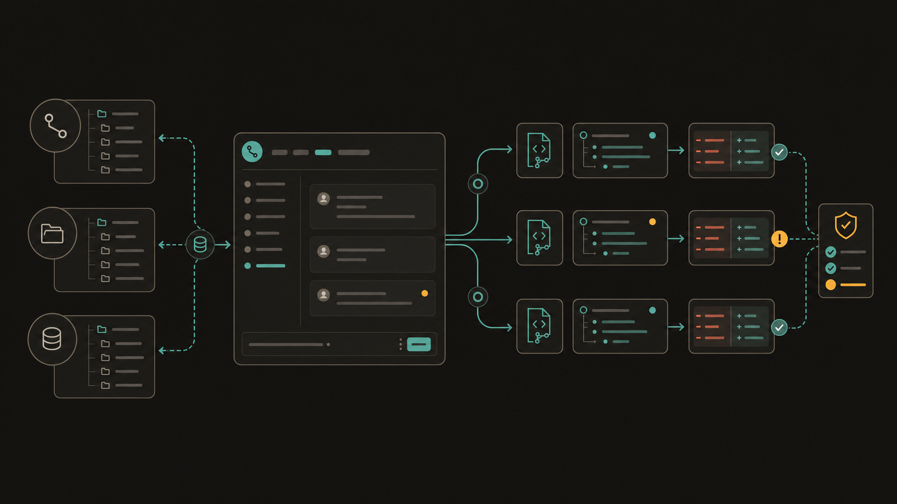
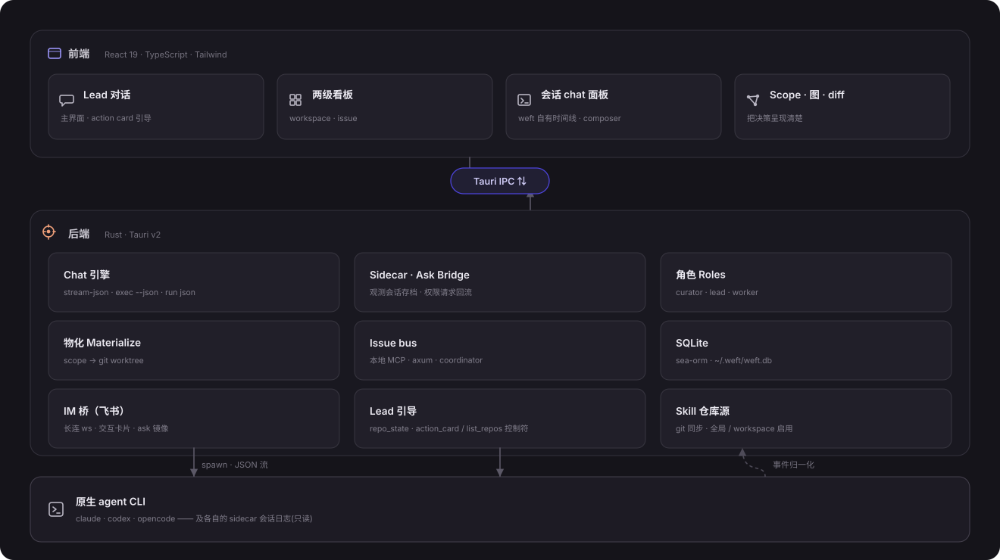

<div align="center">
  

### 本地优先的 Coding 交付系统

Weft 把一个产品目标变成跨多个仓库、可审计的一次完整交付。它在你的电脑上编排你自己的
Claude Code、Codex 和 OpenCode，让每一次写入都受明确权限边界约束，最终交给你的不是
一堆聊天记录，而是证据、决策和可以 Review 的变更。

<sub>Tauri v2 · React 19 · Rust · SQLite · 原生 Coding-Agent CLI</sub>

[English](README.md)
</div>

<p align="center">
  
</p>

## 30 秒看懂

大多数 Coding Agent 工具在优化一次 Session。Weft 想解决的是更完整的问题：让一项交付
跨越多个 Session、多个仓库、各种中断和后续重复工作，仍然能持续推进。

```text
产品目标 → Project 上下文 → 动态变更范围 → 逐仓 Lane
         → 原生 Agent Run → Evidence → Review / 合并 / 发布
```

你只描述一次结果。Weft 判断需要修改哪些仓库、为什么修改，以及应该按什么顺序推进。
Project 权限策略内的工作无需逐仓审批；超出策略、高风险或无法确认的动作，才会停在一个
具体的 Gate 上等待决策。最终得到的是一组相互隔离、经过验证，并且可以在一个界面判断
是否已经准备好 Review 的变更。

**当前已有：** 本地多仓规划、仓库原生 Worktree、原生 Agent Session、可 Review 的 Diff、
PR 前检查、远程提问与审批、防休眠，以及本地状态的加密备份。

**产品方向：** 做成一套可以放心离开、回来立即接手、结果值得信任的交付系统；再逐步形成
Project 内的长期 Agent 花名册，让稳定岗位、明确职责和经过验证的项目知识跨 Issue 延续。

## 最终产品体验

1. **只描述一次目标。** 在一个长期 Project 上下文中创建 Issue；当前界面仍使用
   Workspace 这个名称。
2. **由 Weft 展开交付范围。** Lead 读取仓库关系、当前代码、权限策略和已验证的交付历史，
   持续维护动态变更范围，不要求用户预先把工作拆完。
3. **每个写入仓库都公开可查。** 每个实际写入的仓库都有一条公开 Lane，记录原因、目标、
   依赖、完成条件，以及允许它执行的策略判定。
4. **继续使用已经信任的工具。** Claude Code、Codex 和 OpenCode 在仓库原生 Worktree 中
   执行，保留各自的登录态、Skill、Hook、Sandbox 和可恢复的 Session 身份。
5. **用事实验证，不接受自报完成。** Diff、Commit、检查结果、接口约定、PR、CI、Review、
   冲突、决策和风险都会成为带代码版本的 Evidence。模型正常退出，不等于交付已经完成。
6. **人可以放心离开。** Weft 只在当前策略和本机条件允许时继续推进。中断会进入可恢复状态；
   Coding Agent 触发额度限制时，系统保存恢复点和上下文，在额度恢复且安全检查通过后自动续跑，
   不盲目重试，也不丢失已经完成的工作。
7. **回来先看结果。** Issue 首屏直接说明发生了什么、哪里被阻塞、什么需要你决定，以及距离
   所有活跃 Lane 可以 Review 还差什么。
8. **让经验跨工作延续。** Project 知识保留来源和版本；长期 Agent、岗位和任职关系让责任
   跨 Issue 延续，但不会因此隐式扩大权限。

人负责产品判断、授权和高风险决策；轮询、记录、恢复和日常协调交给 Weft。

## 核心产品对象

| 产品对象 | 它代表什么 |
|---|---|
| **Project** | 长期代码与交付上下文：仓库集合、仓库/服务关系、策略、Skill、已验证知识、Issue，以及未来的 Agent 花名册。当前界面称为 Workspace。 |
| **Issue** | 一项用户可以验收的交付目标，包含动态变更范围、关键决策、整体就绪状态和剩余风险。 |
| **Lane** | 一条公开的写仓单元。每条 Lane 只写一个仓库，并记录原因、目标、依赖、执行要求和权限判定。 |
| **Run** | 一次有起止边界的执行尝试，记录执行者、原生 Session、结果和可恢复的失败状态。重试不会覆盖历史。 |
| **Evidence** | 来自 Git、检查、接口、代码托管平台、决策和交接的紧凑证据，始终保留来源。 |
| **Gate** | 因越界、高风险或事实不足而必须由人完成的一次具体决策；存在安全旁路时，只阻塞受影响的工作。 |
| **Agent · 岗位 · 任职关系** | 跨 Issue 延续的身份、Project 内稳定职责，以及两者之间可追溯的历史关系。它们本身都不授予权限。 |

单仓和多仓工作共用同一套模型。小变更时界面可以保持简洁；只有真实交付跨仓并产生依赖时，
才展开完整控制信息。

## 为什么是 Weft

### 管交付，不只管 Session

一个 Session 可以正常结束，但功能仍然没有做完。Weft 跟踪的是用户结果，覆盖规划、实现、
检查、PR、Review、合并、中断和多次尝试。Session 可以被恢复、替换或重建，交付目标不会
因此丢失。

### 有边界的自主推进，而不是让人反复点批准

每一个实际写入仓库的动作仍然公开、可追溯。AuthorityPolicy 决定哪些工作可以自动推进；
角色、Agent 过往表现或 CLI 的一次权限回答，都不能静默扩大边界。只有出现真正需要判断的
异常时，Weft 才来找人。

### 相信证据，不相信自信的叙述

文件系统和 Git 决定代码事实；代码托管平台决定 PR、CI、Review、冲突和合并事实。
Weft 在执行后重新对账；无法确认发生了什么时，状态保持 Unknown 并停止后续写入。

### 尊重原有工具和仓库

- **继续使用你的 Agent：** Weft 驱动原生 Claude Code、Codex 和 OpenCode CLI。
- **继续遵循仓库习惯：** Worktree 和分支沿用目标仓库自己的目录与命名规则，Weft 不替代
  Git 托管平台。
- **继续积累团队经验：** 个人、Project 和仓库级 Skill/Rule 的实际生效结果都可以检查；
  能固定版本的来源会保留版本，Run 开始前先解析冲突与优先级。

### 本地优先，但人离开后仍然可达

代码、凭据、Agent 进程、Git Worktree 和编排状态默认留在本机。人不在电脑前时，可以通过
飞书/Lark 或钉钉处理具体提问和权限请求；加密快照让本地状态可以恢复，但不会把 Weft 变成
托管在云端的代码执行器。

### Project 会积累经验，但不会变成黑盒记忆

经过验证的仓库关系、接口约定、Skill、失败教训和交付方式，可以改善下一次工作。每条可复用
信息都保留来源、版本、有效状态，并支持纠正、替换和撤销。聊天全文不会静默变成永久事实。

## 权限与安全边界

- 每一次写入都能追溯到公开 Lane，以及当时允许它执行的 AuthorityPolicy 版本。
- 读取仓库和写入仓库是两种不同能力。
- 策略内的工作可以自动推进；保护分支、凭据、发布、生产、不可逆动作、策略变更和无法确认的
  Scope 必须进入 Gate 或直接拒绝。
- Weft 在执行前判断权限，执行后再从文件系统、Git、Push 和 PR 事实中对账。
- 一旦发现策略漂移或状态无法确认，后续写入停止并 Fail Closed。
- Agent 身份、岗位、Role Profile、用户反馈和历史成功都不会扩大权限。
- 生产变更默认不由 Weft 自动执行。

## Roadmap

Roadmap 按用户结果和退出条件排序，不按功能数量或日历日期许诺。当前只承诺正在推进的
里程碑；后续阶段必须由真实交付证明前置能力可靠后，才会进入实施。

| 顺序 | 里程碑 | 用户得到什么 |
|---|---|---|
| **NOW** | **R1 · 跨仓交付闭环** | 描述一次真实需求；Weft 持续维护通过策略判定的逐仓 Lane 及其依赖，直到所有活跃 Lane 都可以 Review。 |
| **NEXT** | **R2 · 可走开与可信恢复** | 人离开界面后，工作仍能安全推进。应用重启、休眠、断网、Run 卡住、凭据过期和 Agent 额度耗尽都会成为可见、可恢复的状态，只在真正需要决策时进入 Needs-you。 |
| **THEN** | **R3 · 过程内收** | 调研、重试、Review、试验和 Subagent 收进所属 Lane；主界面只看交付结果、Evidence、风险和决策，完整 Run 历史仍可展开。 |
| **LATER** | **R4 · Project 知识复利与长期 Agent** | 建立带稳定岗位和任职历史的 Agent 花名册；Agent 跨 Issue 复用经过验证的项目知识、Skill 和交付方式，同时保持记忆与权限透明。 |
| **EXPLORE** | **R5 · Signal / Ops 扩展** | 告警和外部事件先进入有边界的只读分析；一旦需要修改仓库，必须先转成普通 Issue。 |

这个顺序不能颠倒：可靠交付才能产生可信 Evidence；可信 Evidence 才能安全恢复并折叠内部过程；
有了这些基础，Project 记忆和长期 Agent 才不会把未经验证的猜测固化成权限或经验。

## 当前已经可用

- **多仓规划：** 添加、克隆或创建 Workspace 仓库；Lead 根据仓库关系提出按仓拆分的工作，
  并解释为什么需要修改。
- **原生执行：** 经过确认的工作在目标仓库内创建原生 Worktree 和分支；Claude Code、Codex
  和 OpenCode 以原生 CLI Session 运行。
- **受控协作：** Lead/Worker Session、规划工具、本地 Thread Bus、权限请求、排队、打断、
  Resume、Slash Command 和附件都归属同一 Issue。
- **Review 界面：** 已创建的 Worktree 可以查看 Diff 并运行 PR 前检查；同时观察 Claude JSONL、
  Codex Rollout JSONL 和 OpenCode SQLite 中的执行事实。
- **远程可达：** 飞书/Lark 或钉钉可以把 Agent 提问与权限决策带回同一份本地状态。
- **团队配置：** 支持 Git 托管的 Skill 源、保留个人 Skill、按全局或 Workspace 启用，并预览
  每个仓库最终生效的 Skill 和 Rule。
- **长任务安全：** 防休眠、远程待命，以及把加密 `weft.db` 快照备份到私有 Git 远端；
  支持 Recovery Key 导出和恢复。
- **基础管理：** Workspace、Issue 和工作单元的重命名与级联删除，以及中英双语界面。

尚未产品化的能力包括：完整的 Issue/Lane/Run/Evidence 模型、自动创建 PR、保护分支合并编排、
CI/CD 与发布观测、额度感知自动续跑、过程内收、Project 知识和长期 Agent 花名册。它们是
Roadmap 的目标，不是对当前版本的能力宣称。

## 适合谁

Weft 面向已经在本机使用 Coding Agent CLI 的开发者和技术负责人，尤其适合需要同时协调服务端、
SDK、前端、基础设施或版本仓库的工作。当一个 Session 不再够用、工作需要跨中断延续，或者你
希望不重读每段聊天就能判断整项交付是否可以 Review，Weft 才真正体现价值。

如果你的工作基本集中在一个仓库，而且现有的单 Agent、分支和 Review 流程已经足够顺手，
Weft 可能只会增加额外结构。它不替代 Git 托管平台、通用项目管理工具、Coding Agent 本身，
也不替代生产操作的权限控制。

## 当前产品界面

| Workspace 看板 | Issue 看板 |
|---|---|
|  |  |

| 仓库关系 | Lead 对话 |
|---|---|
|  |  |

## 当前架构

<p align="center">
  
</p>

Rust 后端负责本地 SQLite 状态库、Git Worktree 生命周期、Headless Agent 进程、权限注册中心、
本地 Thread Bus、IM 桥、Skill 源、电源管理、加密备份、Computer Use 控制和 Sidecar 观测。
React 前端负责 Workspace/Issue 看板、Lead/Worker Session、Observe/Diff、Settings 和
Needs-you 队列。

## 本地开发

```bash
pnpm install
pnpm dev             # Vite 前端
pnpm build           # TypeScript 检查 + 生产前端 Bundle
pnpm tauri dev       # 完整桌面应用
pnpm tauri build     # Release 应用包
cd src-tauri && cargo test
git diff --check
```

## 目录结构

```text
src/
  board/                Workspace 和 Issue 看板
  session/              对话、观测、Diff、权限请求
  components/           共享 React UI
  i18n/                 中英文文案
src-tauri/src/
  lead_chat/            Headless Agent Session 引擎
  im/                   飞书/Lark 与钉钉桥接
  store/                SQLite/SeaORM 实体与迁移
  bus/                  本地 MCP/Thread Bus
  computer/             受控的桌面 Computer Use
  ask.rs                桌面端与 IM 共用的权限注册中心
  git.rs                仓库和 Worktree 操作
  materialize.rs        有边界的 Worktree 创建
assets/
  screenshots/          README 截图
  diagrams/             架构图
  readme/               README 概览图
```

## 设计约束

Weft 通过结构化 Headless 接口驱动原生 CLI，并渲染自己的产品界面。正常对话界面不嵌入
Terminal/TUI 依赖；Terminal Takeover 只作为逃生入口。跨仓协作信息只保存在 Weft 管理状态
或 Worktree 本地配置中，不会作为隐藏改动写进正式仓库。
