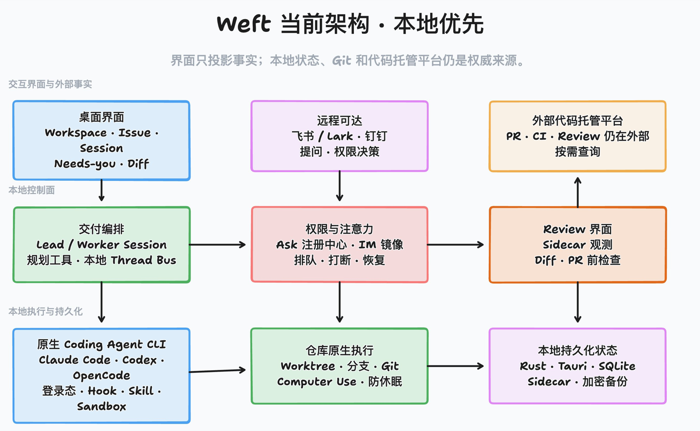

<div align="center">
  

### 本地优先的 Coding 交付系统

Weft 用来完成会跨多个仓库的一项需求。它在你的电脑上调度 Claude Code、Codex 和
OpenCode，把每个仓库的改动隔离在独立 Worktree 中，再把 Diff、检查结果、PR 状态和待决事项
汇总到一个界面。你能直接看到整项交付还差什么，不必重读每个 Agent 的聊天记录。

<sub>Tauri v2 · React 19 · Rust · SQLite · 原生 Coding Agent CLI</sub>

[English](README.md)
</div>

<p align="center">
  
</p>

<p align="center"><sub>一个目标进入 Weft 后，多个仓库在独立 Worktree 中推进，最后汇总 Diff、检查结果、PR 状态和例外决策。</sub></p>

## 30 秒看懂

一项需求可能同时修改客户端、服务端和 SDK。几个 Agent Session 可以分别结束，但接口没有
对齐、某个仓库漏改、CI 还没通过，整项交付依然没有完成。Weft 持续跟踪这层整体进度。

```text
产品目标 → Project 上下文 → 动态变更范围 → 逐仓 Lane
         → 原生 Agent Run → Evidence → Review / 合并 / 发布
```

在目标形态中，你只需要说清结果。Weft 会判断要改哪些仓库、为什么要改，以及它们之间的执行
顺序。策略允许的工作可以继续推进；越界、高风险或事实不足的动作会停在具体的 Gate 上，等你
决定。最后得到的是一组相互隔离、经过验证，并且可以从一个界面 Review 的变更。

**现在已经可用：** 本地多仓规划、仓库原生 Worktree、原生 Agent Session、Diff 与 PR 前检查、
远程提问和审批、防休眠，以及加密 `weft.db` 快照。

**接下来要完成：** 让工作在断网、重启或 Agent 额度触顶后安全恢复；逐步加入 Project 知识和
长期 Agent 花名册，让稳定岗位与责任跨 Issue 延续。

## 最终产品体验

1. **说清一个目标。** 你在长期 Project 上下文中创建 Issue。当前界面仍使用 Workspace 这个
   名称。
2. **让 Weft 展开范围。** Lead 读取仓库关系、当前代码、权限策略和已验证的交付记录，持续更新
   变更范围。你不需要先把工作拆成多个仓库任务。
3. **每次写入都有原因。** 每个需要修改的仓库都有一条公开 Lane，记录目标、依赖、完成条件，
   以及允许它执行的策略判定。
4. **继续使用原生 Agent。** Claude Code、Codex 和 OpenCode 在仓库自己的 Worktree 中运行，
   保留登录态、Skill、Hook、Sandbox 和可恢复的 Session 身份。
5. **用外部事实判断进度。** Diff、Commit、检查结果、接口约定、PR、CI、Review、冲突和风险都会
   变成带来源的 Evidence。Agent 正常退出，只说明一次运行结束。
6. **离开电脑也不会丢进度。** 应用重启、休眠、断网和额度限制都会进入可恢复状态。Agent 额度
   恢复且安全检查通过后，Weft 从保存的恢复点续跑一次，不重复执行已经完成的工作。
7. **回来先看结论。** Issue 首屏直接列出完成项、阻塞点、待决事项，以及哪些 Lane 还没有达到
   Review 条件。
8. **让责任延续。** Project 知识保留来源和版本。长期 Agent、岗位和任职记录可以跨 Issue 复用，
   但不会因此获得额外权限。

产品判断、授权和高风险决策仍由人负责。轮询、记录、恢复和日常协调交给 Weft。

<p align="center">
  
</p>

<p align="center"><sub>额度触顶后保存恢复点；额度恢复且安全检查通过后只续跑一次。第二天直接查看证据、风险和待决事项。</sub></p>

## 核心产品对象

| 产品对象 | 它记录什么 |
|---|---|
| **Project** | 一份长期的代码与交付上下文，包括仓库集合、仓库或服务关系、策略、Skill、已验证知识、Issue，以及未来的 Agent 花名册。当前界面称为 Workspace。 |
| **Issue** | 一项可以验收的产品目标，包括动态变更范围、关键决策、整体就绪状态和剩余风险。 |
| **Lane** | 一个仓库的执行轨道。每条 Lane 只修改一个仓库，并记录原因、目标、依赖、执行要求和权限判定。 |
| **Run** | 一次有起止边界的执行尝试，记录执行者、原生 Session、结果和可恢复的失败状态。重试会新增 Run，不会覆盖历史。 |
| **Evidence** | 来自 Git、检查、接口、代码托管平台、决策和交接的证据，每条都保留来源。 |
| **Gate** | 因越界、高风险或事实不足而需要人完成的一次具体决策。存在安全替代路径时，只阻塞受影响的工作。 |
| **Agent · 岗位 · 任职记录** | 跨 Issue 延续的 Agent 身份、Project 内的稳定职责，以及两者之间可追溯的历史。它们本身都不授予权限。 |

单仓和多仓工作使用同一套模型。小改动只显示必要信息；确实产生跨仓依赖时，界面再展开完整的
Lane 和依赖关系。

## Weft 解决什么问题

### 围绕交付结果

一个 Session 可以正常结束，但需求仍未完成。Weft 跟踪的是从规划到合并的整项结果，包括实现、
检查、PR、Review、中断和多次尝试。某个 Session 被恢复或替换，不会重置交付状态。

### 把自动化关在明确边界内

目标模型会为每次仓库写入记录 Lane 和 AuthorityPolicy 版本。角色、Agent 的历史表现或某次 CLI
授权都不能扩大边界。当前版本仍需人工确认后才会创建 Worktree。

### 用事实判断是否完成

在目标模型中，文件系统和 Git 决定代码事实，代码托管平台决定 PR、CI、Review、冲突和合并
事实。Weft 会在执行后重新对账；无法确认发生了什么时，状态保持 Unknown，后续写入停止。

### 保留现有工具习惯

- **原生 Agent：** Weft 驱动 Claude Code、Codex 和 OpenCode CLI。
- **原生仓库：** Weft 把 Worktree 固定放在 `<repo>/.worktrees/<weft-home>/<branch>` 下。分支
  命名会参考仓库现有 Ref 的风格，Git 托管仍由原平台负责。
- **可检查的配置：** 个人、Project 和仓库级 Skill，以及个人和仓库级 Rule 都能查看实际生效
  结果。能固定版本的来源会保留版本，Run 开始前先解析冲突和优先级。

### 本地执行，远程决策

代码、凭据、Agent 进程、Git Worktree 和编排状态默认留在本机。你离开电脑后，可以通过
飞书/Lark 或钉钉处理具体提问和权限请求。加密 `weft.db` 快照可以恢复编排数据库，但不包含仓库
Worktree、未推送分支或原生 Agent 的外部 Session 数据。

### R4：积累可追溯的项目知识

R4 会让经过验证的仓库关系、接口约定、Skill、失败记录和交付方式用于后续工作。每条可复用
信息都会保留来源、版本和有效状态，并支持纠正、替换或撤销。聊天记录不会自动变成长期知识。

## 目标权限与安全边界

当前版本需要人工确认后才会创建 Worktree。R1 将补齐 Lane、AuthorityPolicy、Gate 和执行结果
对账，形成下面这套权限模型。

- 每次写入都必须追溯到公开 Lane 和对应的 AuthorityPolicy 版本。
- 读取仓库与写入仓库使用不同权限。
- 策略内的工作可以自动推进。保护分支、凭据、发布、生产、不可逆动作、策略变更和范围不明的
  工作必须进入 Gate 或直接拒绝。
- 执行前检查权限，执行后根据文件系统、Git、Push 和 PR 事实对账。
- 发现策略变化或状态不明时，停止后续写入。
- Agent 身份、岗位、Role Profile、用户反馈和历史成功记录都不能扩大权限。
- 生产变更默认不进入自动执行。

## Roadmap

Roadmap 按用户能得到的结果排序，不绑定日历日期。当前只承诺正在推进的里程碑；后一阶段要等
前置能力在真实交付中稳定后再开始。

| 顺序 | 里程碑 | 用户得到什么 |
|---|---|---|
| **NOW** | **R1 · 跨仓交付闭环** | 描述一次真实需求。Weft 持续维护经过策略判定的逐仓 Lane 和依赖关系，直到所有活跃 Lane 都达到 Review 条件。 |
| **NEXT** | **R2 · 可走开与可信恢复** | 关闭界面后，工作仍能安全推进。应用重启、休眠、断网、Run 卡住、凭据过期和 Agent 额度触顶都会成为可见、可恢复的状态，只在需要决策时进入 Needs-you。 |
| **THEN** | **R3 · 收起内部过程** | 调研、重试、Review、试验和 Subagent 归入所属 Lane。主界面只显示交付结果、Evidence、风险和决策，完整 Run 历史仍可展开。 |
| **LATER** | **R4 · Project 知识与长期 Agent** | 建立带稳定岗位和任职历史的 Agent 花名册。Agent 跨 Issue 使用经过验证的项目知识、Skill 和交付方式，记忆与权限仍然公开可查。 |
| **EXPLORE** | **R5 · Signal / Ops 扩展** | 告警和外部事件先进入有边界的只读分析。确实需要修改仓库时，再转成普通 Issue。 |

R1 先产出可信 Evidence，R2 才能据此恢复工作，R3 才能安全收起内部过程。Project 知识和长期
Agent 放在 R4，是为了避免把未经验证的猜测复用到下一项工作。

## 当前已经可用

- **多仓规划：** 添加、克隆或创建 Workspace 仓库。Lead 根据仓库关系提出逐仓任务，并说明
  修改原因。
- **原生执行：** 你确认后，Weft 在目标仓库创建原生 Worktree 和分支，再启动 Claude Code、
  Codex 或 OpenCode CLI Session。
- **受控协作：** Lead/Worker Session、规划工具、本地 Thread Bus、权限请求、排队、打断、
  Resume、Slash Command 和附件都归属同一 Issue。
- **Review 界面：** 查看 Worktree Diff 并运行 PR 前检查，同时观察 Claude JSONL、Codex
  Rollout JSONL 和 OpenCode SQLite 中的执行事实。
- **PR 监控与受控合并：** 轮询已跟踪 GitHub PR 的 CI、Review、未解决讨论、冲突和跨仓上游
  状态。启用自动合并后，也只有最新代码托管事实通过安全门槛才会执行 Squash。
- **远程处理：** 通过飞书、Lark 或钉钉接收 Agent 提问，并把权限决定写回同一份本地状态。
- **团队配置：** 接入 Git 托管的 Skill 源，保留个人 Skill，按全局或 Workspace 启用，并预览
  每个仓库最终生效的 Skill 和 Rule。
- **长任务保护：** 防止系统休眠、进入远程待命，并把加密 `weft.db` 快照备份到私有 Git 远端；
  支持导出 Recovery Key 和恢复快照。
- **基础管理：** Workspace 和 Issue 支持重命名与级联删除；工作单元可以重命名，也可以单独删除
  已创建的 Worktree 并保留任务记录。界面支持中文和英文。

这些能力还在 Roadmap 中：完整的 Issue/Lane/Run/Evidence 模型、自动创建 PR、已跟踪 PR 就绪
状态以外的 CI/CD 与发布观测、额度感知自动续跑、内部过程收纳、Project 知识和长期 Agent
花名册。

## 适合谁

Weft 适合已经在本机使用 Coding Agent CLI，并且经常让一项需求跨服务端、SDK、前端或基础设施
仓库推进的开发者和技术负责人。它尤其适合两种场景：工作需要跨中断延续，或你需要从一个界面
判断整项交付是否达到 Review 条件。

如果工作基本集中在一个仓库，现有的单 Agent、分支和 Review 流程已经够用，Weft 可能会显得
偏重。Git 托管、项目管理、Coding Agent 本身和生产权限仍由各自系统负责。

## 当前产品界面

| Workspace 看板 | Issue 看板 |
|---|---|
|  |  |

| 仓库关系 | Lead 对话 |
|---|---|
|  |  |

## 当前架构

<p align="center">
  
</p>

<p align="center"><sub>桌面端和 IM 负责交互；控制、执行和持久化留在本机，代码托管平台事实由后台定期轮询更新。</sub></p>

Rust 后端管理本地 SQLite 状态库、Git Worktree 生命周期、Headless Agent 进程、权限注册中心、
Thread Bus、IM 桥、Skill 源、电源管理、加密 `weft.db` 快照、Computer Use 和 Sidecar 观测。React 前端
提供 Workspace/Issue 看板、Lead/Worker Session、Observe/Diff、Settings 和 Needs-you 队列。

## 本地开发

```bash
pnpm install
pnpm dev             # Vite 前端
pnpm build           # TypeScript 检查 + 生产前端 Bundle
pnpm tauri dev       # 完整桌面应用
pnpm tauri build     # Release 应用包
cd src-tauri && cargo test
git diff --check
```

## 目录结构

```text
src/
  board/                Workspace 和 Issue 看板
  session/              对话、观测、Diff、权限请求
  components/           共享 React UI
  i18n/                 中英文文案
src-tauri/src/
  lead_chat/            Headless Agent Session 引擎
  im/                   飞书/Lark 与钉钉桥接
  store/                SQLite/SeaORM 实体与迁移
  bus/                  本地 MCP/Thread Bus
  computer/             受控的桌面 Computer Use
  ask.rs                桌面端与 IM 共用的权限注册中心
  git.rs                仓库和 Worktree 操作
  materialize.rs        有边界的 Worktree 创建
assets/
  screenshots/          README 截图
  diagrams/             架构图
  readme/               README 概览图
```

## 设计约束

Weft 通过结构化 Headless 接口驱动原生 CLI，并使用自己的界面展示对话和执行状态。正常对话
由 Weft 自己渲染，Terminal Takeover 只用于必须直接接管终端的情况。跨仓协作信息只保存在
Weft 管理状态或 Worktree 本地配置中，正式仓库不会收到隐藏的协作改动。
